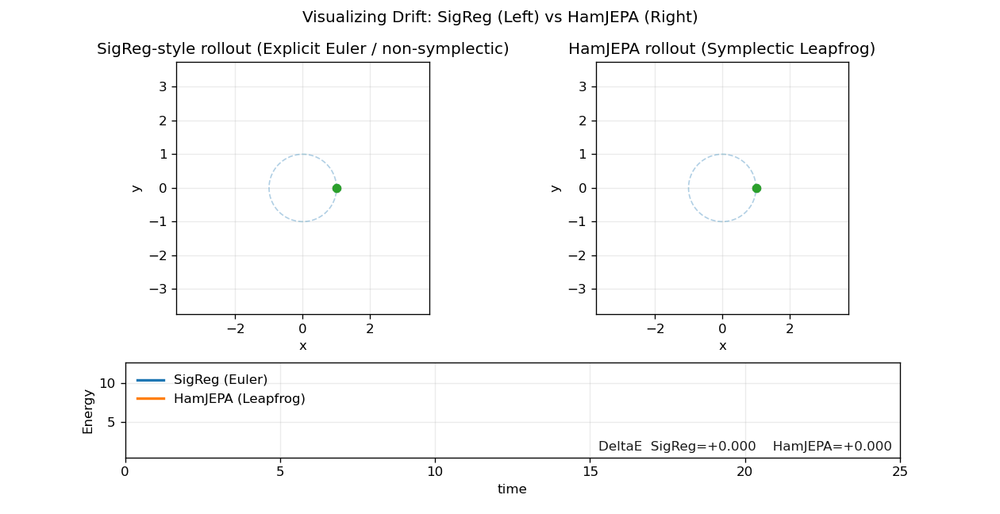
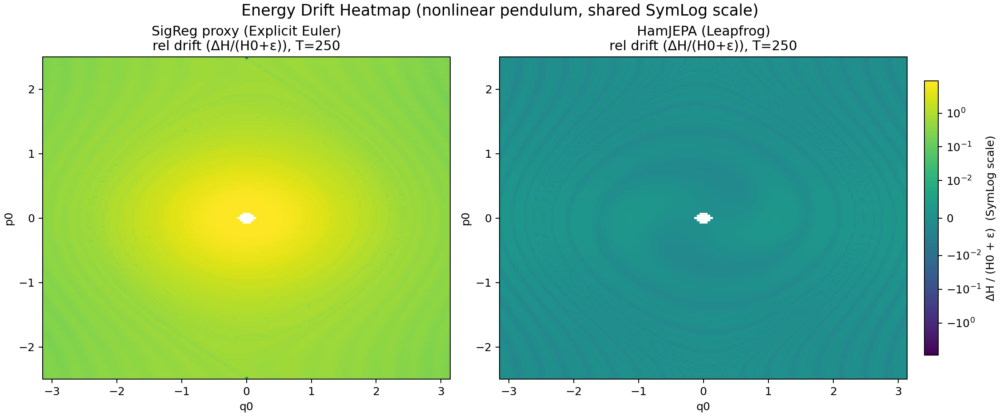
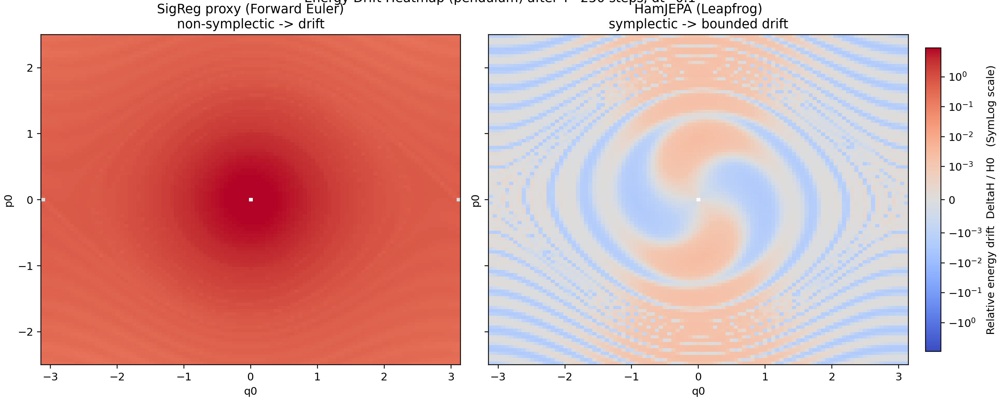
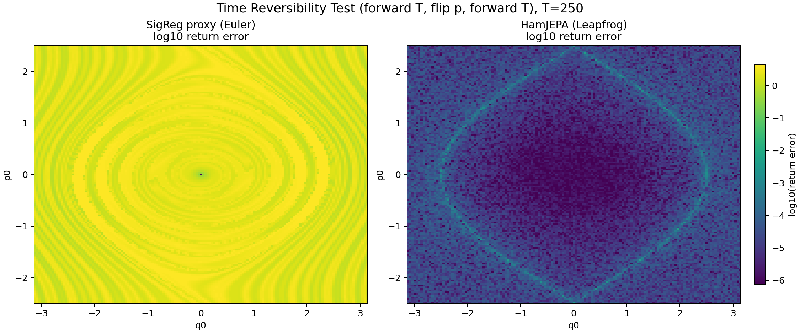
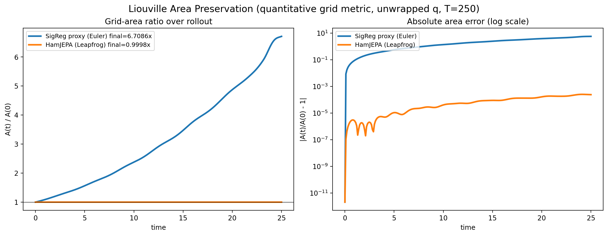
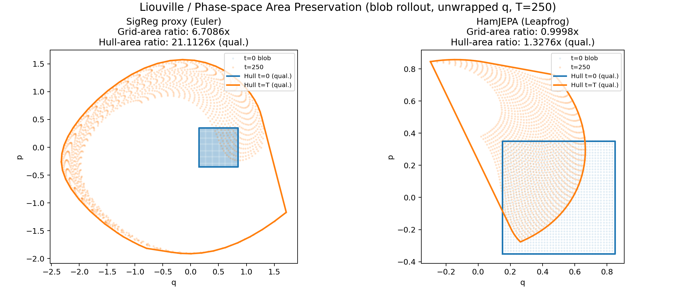
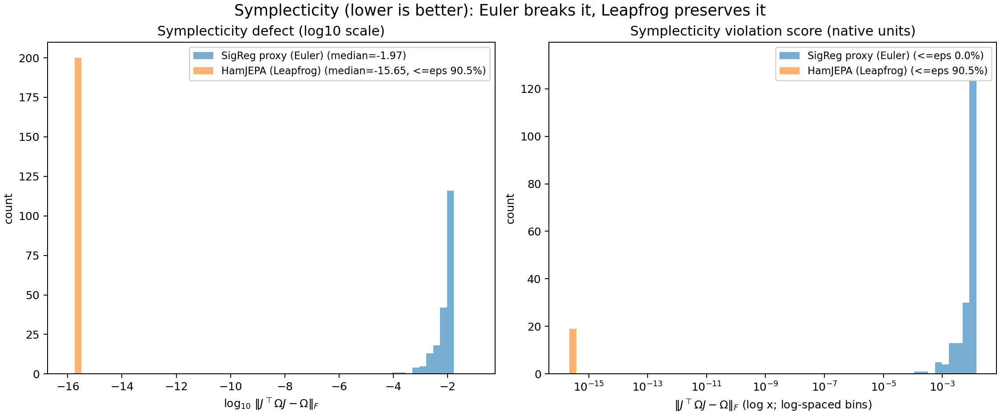
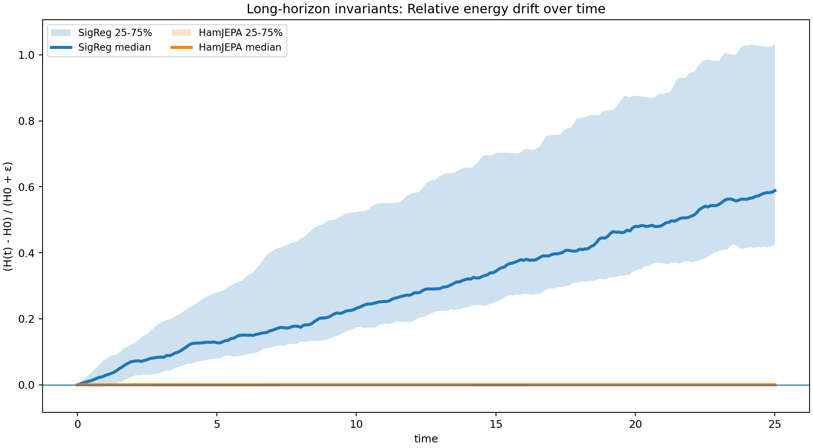
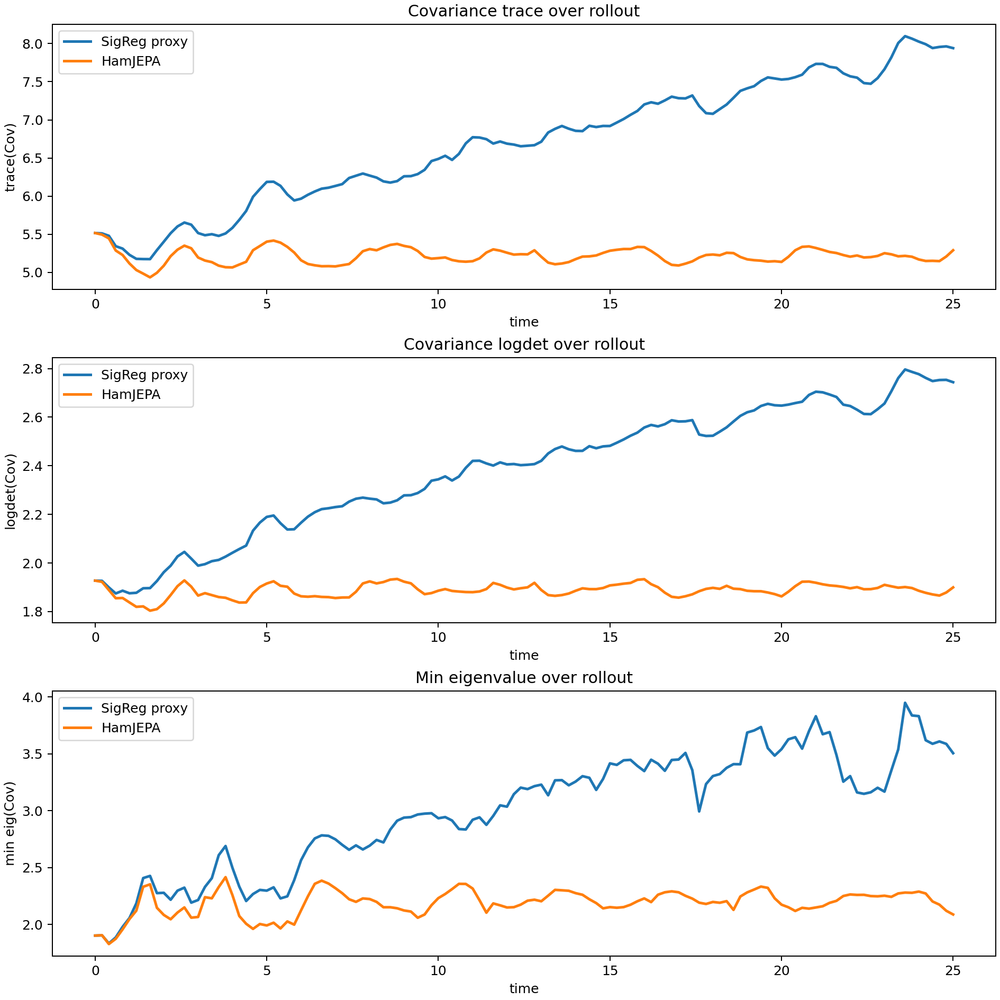

# HJEPA / SIGReg (JEPA-ML)

> IMPORTANT LICENSE NOTICE (LeJEPA upstream)
>
> This codebase contains code adapted from LeJEPA (and/or code that is a derivative work of LeJEPA).
> The upstream LeJEPA license is Creative Commons Attribution-NonCommercial 4.0 International (CC BY-NC 4.0).
>
> Therefore, any use of that code in this repository - namely the univariate and multivariate folders and by extension sigreg.py - must comply with CC BY-NC 4.0 (attribution, non-commercial use, etc.). An alternative to sigreg.py is provided in sigreg_wrapper.py, however that file was not used in the paper.
>
> - License text: Attribution-NonCommercial 4.0 International (CC BY-NC 4.0)
> - https://creativecommons.org/licenses/by-nc/4.0/
> - LeJEPA repository: https://github.com/galilai-group/lejepa
>

## What this repo is

This repo is a compact research codebase for training and analyzing:

- SIGReg baselines (representation regularization / covariance objectives).
- HJEPA (Hamiltonian JEPA): a JEPA-style predictor augmented with Hamiltonian dynamics
  (symplectic integration plus a learnable potential) to encourage structured latent evolution.

Primary targets used in practice:

- CIFAR-100 (fast iteration)
- ImageNet-100 (larger scale; subject to dataset license restrictions)

The project supports:

- Univariate and multivariate coordinate modes (for example, matching only `q`, only `p`, or concatenated `(q,p)` states)
- Multi-view training (global views, optional local views / multi-crop)

## Repository layout (key files)

Core scripts and modules:

- `scripts/train_cifar_hamjepa.py` - CIFAR-100 training loop.
- `scripts/train_imagenet_hamjepa.py` - ImageNet-style training loop.
- `eval/models/encoder_resnet.py` - ResNet encoder backbone.
- `hamjepa/projector.py` - Projector MLP(s).
- `hamjepa/predictor.py` - Predictors, including Hamiltonian predictor.
- `hamjepa/hamiltonian.py` - Hamiltonian model(s), separable Hamiltonians, potential networks.
- `hamjepa/integrators.py` - Symplectic integrators (leapfrog, etc.).
- `eval/datasets/imagenet_multicrop.py` - ImageNet multi-crop dataset wrapper.

Configs:

- `configs/cifar100_hjepa_mv.yaml`
- `configs/cifar100_sigreg_tokens.yaml`
- `configs/imagenet_hjepa_mv.yaml`
- `configs/imagenet_sigreg_tokens.yaml`

Artifacts:

- `eval_runs/.../metrics.json` - evaluation outputs and diagnostics.

## Setup

### 1) Environment

Recommended:

- Python 3.10+
- PyTorch and torchvision matched to your CUDA stack

Example install:

```bash
pip install torch torchvision --index-url https://download.pytorch.org/whl/cu121
pip install pyyaml tqdm
```

### 2) Reproducibility / speed knobs

You can control:

- `seed` in YAML configs
- deterministic vs speed backend settings

For speed on Ampere/Hopper class GPUs:

- `torch.backends.cudnn.benchmark = True`
- TF32 enabled for matmul/conv where appropriate

## Data

### CIFAR-100

Uses torchvision CIFAR-100. No manual download needed.

### ImageNet-100

Expected folder layout:

```text
/path/to/imagenet100/
  train/
    class_001/
      img1.jpg
      img2.jpg
      ...
    class_002/
      ...
  val/
    class_001/
      ...
```

Do not redistribute ImageNet data (including ImageNet-100 subsets) unless explicitly permitted by dataset terms.


## Configuration guide (YAML)

### Data / multi-crop

Common knobs:

- `data.batch_size`, `data.num_workers`
- `data.num_global_views`, `data.num_local_views`
- crop size/scale fields in the dataset config used by each train script

### HJEPA knobs

Important dynamics knobs:

- `dt`, `steps` - integrator step size and number of steps.
- `residual_scale` - scales residual potential term. Too high can create stiff-potential behavior.
- `base_coeff` - base quadratic energy coefficient.
- `damping` (if enabled) - momentum damping.

Matching choice:

- `loss.match: q` - supervise only `q`.
- `loss.match: p` - supervise only `p`.
- `loss.match: qp` - supervise full state `(q,p)`.

In practice, choose based on stability and your objective:

- `q` is often easier to stabilize early.
- `qp` is stricter and can improve full-state consistency if training is stable.

## Interpreting logs

Typical fields:

- `pred` - predictor loss.
- `budget` - budget/constraint regularizer term.
- `logdet` - projected covariance spread regularizer.
- `[MV] ... q_pr / p_pr ... V_var ...` - multivariate diagnostics.

Useful diagnostics:

- `q_pr`, `p_pr` - participation-ratio style effective-rank proxies (higher usually means less collapse).
- `q_std_min` - minimum projected std; very low values can indicate collapse.
- `q2`, `p2` - mean squared norms; near-zero or runaway values indicate instability.
- `V_var` - batch variance of potential values; large sustained growth can indicate stiffness.

## Notes on caching and throughput

RAM-caching decoded PIL images is often memory-heavy. If you cache, prefer compressed bytes and decode on access.

On fast GPUs, throughput is commonly limited by CPU-side multi-crop augmentation. If needed, tune DataLoader workers/prefetch and profile data-time vs step-time directly.

## Disclaimer

This is research code and may have rough edges. If training becomes unstable, check:

- data pipeline throughput
- augmentation intensity
- mixed precision / backend settings
- HJEPA dynamics knobs (`residual_scale`, `base_coeff`, `dt`, `steps`, `damping`)
- regularizer strength / floor settings

## Acknowledgments & References

If you use LeJEPA or code from this repository in your research, please cite the original work:

```bibtex
@misc{balestriero2025lejepaprovablescalableselfsupervised,
      title={LeJEPA: Provable and Scalable Self-Supervised Learning Without the Heuristics}, 
      author={Randall Balestriero and Yann LeCun},
      year={2025},
      eprint={2511.08544},
      archivePrefix={arXiv},
      primaryClass={cs.LG},
      url={https://arxiv.org/abs/2511.08544}, 
}
```

## Physics sanity checks: SigReg-style rollouts vs HamJEPA (symplectic)

This repo contains a **physics showcase** that makes a single point very explicit:

> If you repeatedly roll out an unconstrained one-step predictor, you are iterating a generic (typically non-symplectic) map.  
> Over long horizons that map will generally drift in the quantities Hamiltonian flows preserve: **symplectic form**, **phase-space volume (Liouville)**, and (often) **energy**.  
> In contrast, a Hamiltonian-structured model integrated with a **symplectic integrator** preserves the correct geometry and remains stable over long rollouts.

### Setup

We consider canonical Hamiltonian dynamics on phase space \(x=(q,p)\) with Hamiltonian \(H(q,p)\). The continuous-time dynamics are:

\[
\dot{q}=\frac{\partial H}{\partial p},\qquad \dot{p}=-\frac{\partial H}{\partial q},
\]
or compactly \(\dot{x} = \Omega \nabla H(x)\) where
\[
\Omega=\begin{bmatrix}0 & 1\\-1 & 0\end{bmatrix}.
\]

We compare two rollout mechanisms:

- **SigReg-style proxy (non-symplectic)**: explicit Euler on the Hamiltonian vector field  
  \[
  x_{t+1}=x_t + \Delta t\,f(x_t),\quad f(x)=\Omega\nabla H(x).
  \]
  This stands in for “generic learned one-step updates” that do not enforce symplectic structure.

- **HamJEPA-style (symplectic)**: leapfrog / Störmer–Verlet integration of \(H\).  
  Leapfrog is a standard **symplectic** and **time-reversible** integrator.

These tests are deliberately **model-agnostic**: you can replace “Euler” with *any learned one-step map* and run the same diagnostics; the failure modes are the same.

---

## 0) Visual hook: drift shows up immediately in trajectory geometry

### 0.1 Phase-plane drift + energy trace (GIF)



**What it is:** A simple 2D orbit visualization (left: SigReg/Euler, right: HamJEPA/Leapfrog) plus a bottom panel tracking energy over time.

**What it demonstrates (geometry-first):**
- For Hamiltonian systems, trajectories evolve on level sets of \(H\) (in the ideal continuous system).
- A non-symplectic discrete map typically either injects or dissipates energy and distorts the orbit geometry over time.
- A symplectic integrator preserves the qualitative orbit structure: energy error is bounded and the orbit remains on/near a nearby invariant curve.

**Why this is “the” core story:** Long-horizon stability is primarily a *geometric* issue. If the discrete map is not symplectic, the numerical trajectory does not approximate a Hamiltonian flow in the long run; it approximates a different dynamical system with artificial contraction/expansion.

---

### 0.2 Energy surface view (GIF)


https://github.com/user-attachments/assets/d4216dca-52b7-4170-8f57-24e209e37a49


**What it is:** Same underlying idea, but embedded on the **energy surface** \(H(q,p)\) as a 3D plot: the trajectory is plotted as a curve in \((q,p,H)\).

**Interpretation:**
- In a perfect Hamiltonian flow, \(H(q(t),p(t))\) is constant, so the curve should lie on a horizontal “slice” of the surface.
- For non-symplectic rollouts, the curve climbs/descends the surface (systematic energy drift).
- For symplectic rollouts, the curve stays near a constant-energy manifold; residual error is typically oscillatory and bounded (see “backward error analysis” note below).

**Deep point:** Symplectic integrators do *not* preserve the exact \(H\) in general. Instead, they exactly preserve a **modified Hamiltonian** \(\tilde H = H + O(\Delta t^2)\), which implies energy errors remain bounded over long times rather than accumulating linearly.

---

## 1) Energy drift heatmaps: stability over a large set of initial conditions

We next evaluate energy drift **as a function of initial condition** \((q_0,p_0)\). This tests not just a single trajectory, but the entire map’s long-horizon behavior over phase space.

### 1.1 Nonlinear pendulum drift (SymLog, shared normalization)



**What it is:** For each initial condition \((q_0,p_0)\) on a grid, roll out \(T\) steps and compute a stabilized relative drift:
\[
\frac{\Delta H}{H_0+\varepsilon}=\frac{H(q_T,p_T)-H(q_0,p_0)}{H(q_0,p_0)+\varepsilon}.
\]
A **symmetric-log** normalization is used so that both “large drift” and “tiny drift” are simultaneously visible.

**Why the center is masked/white:** Near the stable equilibrium of the pendulum, \(H_0 \approx 0\). Any relative metric \(\Delta H/H_0\) is ill-conditioned there, so points with too-small \(H_0\) are masked (or stabilized by \(\varepsilon\)).

**What “good” looks like:** The HamJEPA/Leapfrog panel should remain close to zero across most of phase space, with structured small residuals (often oscillatory, often correlated with regions of high curvature / nonlinearity).

**What “bad” looks like:** The SigReg/Euler panel shows broad regions of systematic drift. This is the signature of iterating a non-symplectic map: it does not preserve the Hamiltonian geometry, so errors accumulate coherently.

---

### 1.2 Alternate visualization: pendulum drift with diverging colormap (SymLog)



This figure communicates the same signal with a more “poster-friendly” diverging colormap and (optionally) energy contours.

**Key interpretive difference between Euler and leapfrog:**
- Euler drift tends to be **biased** (systematically positive/negative) because it introduces spurious expansion/contraction in phase space.
- Leapfrog drift tends to be **balanced** (positive and negative regions) and does not grow without bound: the integrator tracks a nearby modified Hamiltonian.

---

## 2) Time reversibility: a structural test, not an accuracy test



**What it is:** A forward–reverse consistency test based on the standard momentum flip involution:
\[
R(q,p)=(q,-p).
\]
A time-reversible integrator (self-adjoint method) satisfies:
\[
R\circ \Phi_{\Delta t}\circ R \approx \Phi_{-\Delta t}.
\]

**The test implemented:**
1. Roll forward \(T\) steps: \(x_T=\Phi_{\Delta t}^T(x_0)\)
2. Flip momentum: \(\hat x_T = R(x_T)\)
3. Roll forward \(T\) steps again: \(x'=\Phi_{\Delta t}^T(\hat x_T)\)
4. Flip back: \(x_{\text{return}}=R(x')\)
5. Measure return error: \(\|x_{\text{return}}-x_0\|\) (with angle-wrap for periodic \(q\)).

**Why this matters:**
- Hamiltonian flows are time-reversible under \(p\mapsto -p\).
- Leapfrog is explicitly constructed to be time reversible.
- Explicit Euler is not time reversible; it breaks the self-adjoint property at the method level.

**What you should see:**
- **HamJEPA/Leapfrog** returns with errors near floating-point / discretization limits across most of phase space (dark panel).
- **SigReg/Euler** shows much larger return errors (bright panel), often structured by the dynamics (nonlinearity, separatrices, etc.).

**Important nuance:** This is not “accuracy in the usual sense.” It is a **structural** check: reversible methods produce symmetric error behavior forward/backward; non-reversible methods produce biased accumulation.

---

## 3) Liouville: phase-space area preservation (2D canonical case)

Hamiltonian flows preserve phase-space volume (Liouville’s theorem). In 2D \((q,p)\), “volume” is just **area**.

For a discrete-time map \(F\), the continuous-time statement becomes a property of the Jacobian:
- Exact symplecticity implies
  \[
  J(x)^\top \Omega J(x)=\Omega.
  \]
- In 2D this implies \(\det J(x)=1\), hence **area preservation**.
- Note: \(\det J=1\) alone is not sufficient for symplecticity in higher dimensions; that’s why we also compute the full symplectic defect later.

### 3.1 Quantitative area preservation (grid-based metric)



**What it is:** Start with a small structured grid patch around a blob center, roll out the entire grid through time, and estimate the patch area by summing triangle areas per cell (a discrete approximation to integrating \(|\det J|\) over the patch).

We plot:
- \(A(t)/A(0)\): should stay at 1 for area-preserving maps.
- \(|A(t)/A(0)-1|\) on a log scale: makes small errors visible and separates numerical noise from systematic drift.

**Why “unwrapped \(q\)” matters:** Angle wrapping is discontinuous. Any discontinuity destroys Jacobians and can create artificial area changes. So Liouville diagnostics must operate on a continuous chart; here we intentionally use **unwrapped** \(q\) for area metrics.

**Expected behavior:**
- **Leapfrog**: \(A(t)/A(0)\approx 1\) for all \(t\); residuals grow slowly (often near roundoff + accumulated numerical error).
- **Euler**: area ratio drifts away from 1 (often exponentially in linear systems, and systematically in nonlinear ones).

**Deep point (linear intuition):** For the harmonic oscillator, the explicit Euler update matrix has \(\det A_{\text{Euler}} = 1+\Delta t^2>1\), so the map expands area at every step. Repeated composition yields \(A(t)\propto (1+\Delta t^2)^t\). Symplectic methods enforce \(\det=1\) by construction.

---

### 3.2 Qualitative blob deformation (with “grid area” as the real metric)



**What it is:** A visual overlay of the initial blob \(t=0\) and its image after \(T\) steps under each method, plus two reported ratios:
- **Grid-area ratio**: primary quantitative Liouville metric (structured-grid area).
- **Hull-area ratio**: convex hull area; explicitly labeled as *qualitative* because it can be biased by shape nonconvexity and filamentation.

**What to look for:**
- Euler tends to create spurious global expansion/contraction, producing visibly “inflated” or “collapsed” blobs.
- Leapfrog can strongly deform the blob (shear/rotation is normal) while preserving area.

**Why the hull ratio is only qualitative:** Hamiltonian dynamics frequently generate filamentation—long thin structures. The convex hull can grow a lot even if the actual area is conserved (it “wraps around” empty space). The structured-grid area metric does not have this failure mode.

---

## 4) Symplecticity defect: local, first-principles verification



A map \(F\) is symplectic iff:
\[
J(x)^\top \Omega J(x)=\Omega,\qquad J(x)=\frac{\partial F}{\partial x}.
\]
We measure violation by the Frobenius norm:
\[
d(x)=\|J(x)^\top \Omega J(x)-\Omega\|_F.
\]

**What this figure contains:**
- Left panel: histogram of \(\log_{10} d(x)\) — this makes “near machine precision” symplecticity visible instead of compressing it into a spike at 0.
- Right panel: histogram of raw \(d(x)\) using log-spaced bins — this shows the distribution in physical units.

**Two implementation details that matter (and are easy to get wrong):**
1. **Do not wrap \(q\)** inside the map for Jacobians. Angle wrapping is discontinuous and will dominate the Jacobian with artificial jumps.
2. Use **float64** for Jacobians; otherwise leapfrog’s defect will be masked by float32 roundoff.

**How to read the result:**
- Leapfrog should concentrate near numerical precision (a large fraction at/below machine epsilon).
- Euler should show a defect on the order expected from theory. For Hamiltonian vector fields, the Euler map is “first-order close” but not symplectic; the leading symplecticity defect typically scales like \(O(\Delta t^2)\), i.e. \(\log_{10} d \approx \log_{10}(\Delta t^2)\).

**Why this diagnostic is stronger than energy drift alone:**
- Energy drift can look small over short horizons even for non-symplectic maps (especially with tuned step sizes).
- Symplecticity defect directly measures whether the map preserves the canonical 2-form, independent of a particular invariant or time horizon.

---

## 5) Long-horizon invariants: robust energy drift statistics



**What it is:** Sample many random initial conditions, roll out \(T\) steps, and compute the stabilized relative energy drift:
\[
\frac{H(t)-H_0}{H_0+\varepsilon}.
\]
We summarize across the ensemble using:
- the **median** drift curve, and
- an **IQR band (25–75%)** to show typical spread without being dominated by outliers.

**Why median/IQR instead of mean:** In nonlinear systems, a small fraction of initial conditions can exhibit much larger drift (e.g., near separatrices). Means are pulled by these tails; median/IQR is a more stable “typical behavior” descriptor.

**Expected qualitative behavior:**
- **Non-symplectic rollout:** median drift grows with time; IQR often widens, indicating systematic accumulation and increasing sensitivity.
- **Symplectic rollout:** drift remains near zero and typically oscillatory; IQR stays tight because errors do not accumulate coherently.

**Connection to backward error analysis:** A symplectic integrator evolves the system under a nearby Hamiltonian \(\tilde H\). That implies energy error does not perform a random walk with variance growing \(\propto t\); it remains bounded (often with small oscillations).

---

## 6) Covariance stability: ensemble-level “distribution health” over rollout



This diagnostic treats the rollout as an evolution of an **ensemble** of points and monitors second-order distribution statistics:
- \(\mathrm{tr}(\mathrm{Cov})\): overall spread (sum of variances)
- \(\log\det(\mathrm{Cov})\): log-volume proxy of the covariance ellipsoid
- \(\lambda_{\min}(\mathrm{Cov})\): smallest principal variance (detects collapse / degeneracy)

**Important interpretation nuance:** These are not invariants of general nonlinear Hamiltonian flows; the covariance can change under true dynamics (shear/rotation can alter covariance). The point of this plot is comparative:
- Non-symplectic drift tends to create **unphysical expansion or contraction** of ensembles.
- Symplectic integration tends to keep ensembles “healthy” (no artificial explosion/collapse) unless the true dynamics themselves stretch strongly.

**Why it complements Liouville:**
- Liouville tests volume preservation of a *small patch*.  
- Covariance stability tests whether *a broader ensemble* remains well-behaved under long rollouts, which is closer to how learned models are used in practice (multi-step prediction on distributions of states).

---

## Reproducing the figures

Main physics showcase (all PNGs in `assets/physics_showcase`):

```bash
python scripts/physics_showcase_sigreg_vs_hamjepa.py \
  --out_dir assets/physics_showcase \
  --device cpu \
  --all
```

Additional visual hooks (GIFs + alternate heatmap):

```bash
# 2D orbit + energy trace GIF
python scripts/visual_hook_sigreg_vs_hamjepa.py \
  --out assets/visualizing_drift_sigreg_vs_hamjepa.gif \
  --device cpu

# 3D energy-surface GIF + alternate drift heatmap
python scripts/visual_hook_energy_surface_and_heatmap.py \
  --out_dir assets/visuals \
  --device cpu
```

Other script files that generate these figure assets:
- `scripts/physics_showcase_sigreg_vs_hamjepa.py`
- `scripts/visual_hook_sigreg_vs_hamjepa.py`
- `scripts/visual_hook_energy_surface_and_heatmap.py`
